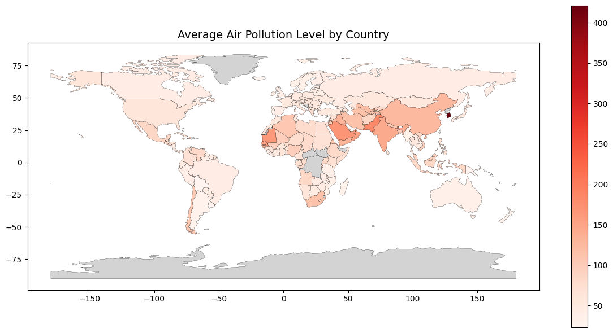

# Global Air Pollution Levels Analysis



This repository contains a Jupyter Notebook that analyzes air pollution levels across various cities and countries using the [World Air Quality Index by City and Coordinates](https://www.kaggle.com/datasets/adityaramachandran27/world-air-quality-index-by-city-and-coordinates) dataset from Kaggle. The project explores air quality insights and visualizes average air pollution levels by country on a world map.

## Project Overview

The notebook performs the following tasks:
1. **Data Loading and Exploration**: Loads the air quality dataset and inspects its structure.
2. **Data Processing**: Computes the average Air Quality Index (AQI) per country.
3. **Visualization**: Generates a choropleth map displaying average air pollution levels by country using a world map shapefile.

### Dataset
The dataset includes air quality statistics for cities worldwide, with the following key columns:
- `Country`: Name of the country
- `City`: Name of the city
- `AQI Value`: Overall Air Quality Index value
- `AQI Category`: Category of the AQI (e.g., Good, Moderate)
- `CO AQI Value`, `Ozone AQI Value`, `NO2 AQI Value`, `PM2.5 AQI Value`: Specific pollutant AQI values
- `lat`, `lng`: Latitude and longitude coordinates

### Dependencies
The project relies on the following Python libraries:
- `pandas`
- `numpy`
- `matplotlib`
- `seaborn`
- `geopandas`
- `contextily`
- `shapely`

These can be installed via pip:
```bash
pip install pandas numpy matplotlib seaborn geopandas contextily shapely
```

## Setup Instructions

1. Clone the Repository:
```bash
git clone https://github.com/yourusername/global-air-pollution-analysis.git
cd global-air-pollution-analysis
```

2. Natural Earth Shapefile:
- The ne_110m_admin_0_countries shapefile (110m resolution) is included in the repository. Ensure all related files (.shp, .dbf, .shx, etc.) are present in the ne_110m_admin_0_countries directory.
- If missing, download from Natural Earth and extract to the appropriate folder.

## Usage

1. Run the Notebook: Launch Jupyter Notebook or JupyterLab:
```bash
jupyter notebook
```
Open eda_world_air_pollution.ipynb and execute the cells sequentially.

2. Key Steps in the Notebook:
- Install contextily: The first cell installs contextily if not already present.
- Load Libraries and Data: Imports required modules and loads the dataset into a pandas DataFrame.
- Data Cleaning:  Eliminates rows with NaN values for analysis suitability.
- Data Processing: Calculates required statistics to gain meaningful insights like the correlation between different pollution index values, etc.
- Visualization: Creates plots and visualizations, utilizing modules like `matplotlib`, 
`seaborn`, `geopandas`, etc.

## Acknowledgments
Dataset provided by Aditya Ramachandran via [Kaggle](https://www.kaggle.com/datasets/adityaramachandran27/world-air-quality-index-by-city-and-coordinates).
World map shapefile from [Natural Earth](https://www.naturalearthdata.com/).